= Getting Started with the Bare-bones Java App Template
Steve Hannah
:doctype: book
:encoding: utf-8
:lang: en
:toc: left
:docinfo: private

The Java App Template is a maven starter project for building a cross-platform, native mobile app in Java, using https://www.codenameone.com[Codename One].

TIP: This project uses Java as the main app programming language.  If you would prefer to use Kotlin, check out the https://shannah.github.io/cn1app-archetype-kotlin-template/getting-started.html[Bare-bones Kotlin App template].

**Features of this project**

CSS::
Uses CSS to customize the theme.  See the `common/src/main/css` directory for CSS sources.

Cross-platform::
It includes Maven goals for building native apps for <<ios,iOS>>, <<android,Android>>, <<mac-desktop,Mac>>, <<windows-desktop,Windows>>, <<javascript,Javascript>>, and as a <<javase,cross-platform JavaSE desktop app>>.

Maven::
As mentioned above, this is a Maven starter project.  This means that it uses maven to manage all dependencies and for building the project.

IDE Integration::
The project includes IntelliJ and NetBeans configuration to expose the important goals as convenient menus.  For tighter integration, you can also install the Codename One plugin in your IDE.  See https://www.codenameone.com/getting-started.html[Getting Started with Codename One] for instructions.

**Scope of this Tutorial**

This tutorial describes how to:

. <<generating-new-project, Generate a new project from this template>>
. <<running, Run the project in the Codename One Simulator>>
. <<build-app, Build the project>> for your desired platform.  A variety of build targets are supported, including <<ios,iOS>>, <<android,Android>>, <<mac-desktop, Mac>>, <<windows-desktop, Windows>>, <<javascript, Javascript>>, and as a <<javase, JavaSE Desktop app>>.
. Opening the project in your IDE (IntelliJ, NetBeans, Eclipse, etc...).

For more in-depth documentation on Codename One, please visit the https://www.codenameone.com[Codename One website].

== Prerequisites

To run and build the project, you should be running a modern version of Mac OS, Windows, or Linux with JDK 8 or higher installed.

====
**Installing OpenJDK**

There are many distributions of OpenJDK available.  Some of the more popular ones include:

. https://adoptopenjdk.net/[AdoptOpenJDK]
. https://www.azul.com/downloads/zulu-community/?package=jdk[Zulu]
. https://aws.amazon.com/corretto/[Corretto]

You will find download links for many versions of the JDK on the above websites.  This tutorial was written using JDK 11.
====

TIP: This project includes a Maven wrapper script that will automatically install Maven if you don't have it installed already.

[#generating-new-project]
== Generating a New Project from this Template

. Go to https://start.codenameone.com/ and select "Bare-bones Java App" from the "Template" menu:
+
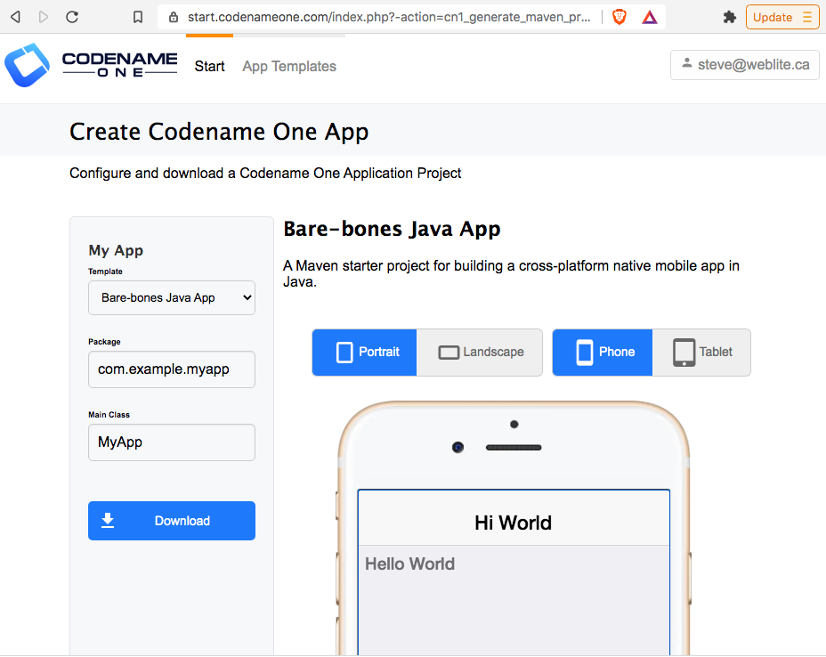
. Enter a "Package" and "Main Class" for your app.  The package will be used both for your App ID, when you submit your app to the app stores, and for your maven project's `groupID`.  The "Main Class" is the name of the "main" Java class for your app.
. Press "Download"

This will prompt you to save the project as a .zip file.

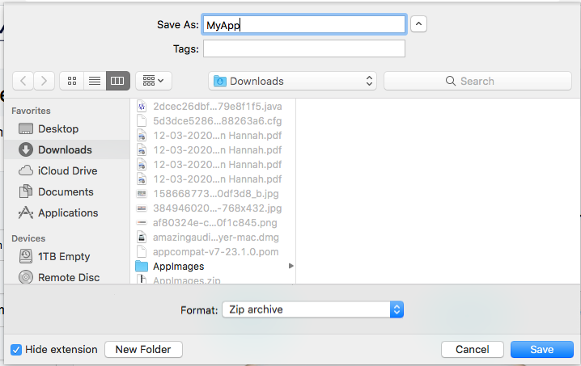

Select where you want the project saved, and press "Save".

After the download completes, you should extract the zip file.

[#running]
== Running the Project in the Codename One Simulator

You can run the project directly from the <<running-on-cli,command-line>> or you can open the project in your preferred IDE (e.g. <<run-in-intellij,IntelliJ>> or <<run-in-netbeans,NetBeans>>) and run the project there.

[#running-on-cli]
[discrete]
=== Running the project from the Command Line
++++
<env cli ></env>
++++
The project comes bundled with `run.sh` and `run.bat` scripts that will allow you to run the project from the command line.  If you are on Windows, you should use the `run.bat` script.  If you are on Linux or Mac, you should use the `run.sh` script.

.Running app on Linux/Mac
[source,bash]
----
cd MyApp
./run.sh
----

.Running app on Windows
[source,bash]
----
cd MyApp
run.bat
----

[TIP]
====
The `run.sh` and `run.bat` scripts are just thin wrappers around maven.  You could alternatively run the project in simulator by running the following command directly on Maven.

[source,bash]
----
mvn verify -Psimulator -Dcodename1.platform=javase
----
====

If all goes well, the https://www.codenameone.com/codename-one-simulator.html[Codename One Simulator] should open up, and you should see the app.

See <<first-run-in-simulator>> for the expected result.

[#run-in-intellij]
[discrete,env]
=== Running the Project in IntelliJ IDEA
++++
<env intellij ></env>
++++

IntelliJ can open this project and work with it natively without requiring any special plugins.  This is because IntelliJ supports Maven projects natively, and this is a Maven project.

To run this project in IntelliJ IDEA, start by opening the project in IntelliJ.

[TIP]
====
There are many ways to do this and the specifics may depend on your operating system.

E.g. On Mac, I can open a project directly from the Terminal by running `idea path/to/MyApp`.

I can alternatively drag the "MyApp" directory onto the "IntelliJ IDEA" application icon in the Finder.

Alternatively, I can open IntelliJ, and select `File` > `Open...` from the menu.
====

Once the project is open, you should see the Configuration menu in the upper right on the toolbar with the option "Run in Simulator" already selected as shown below:

image::images/idea-toolbar.png[]

[TIP]
====
If you don't see "Run in Simulator" selected in the configuration menu, click on the menu and select it from the options listed as shown below:

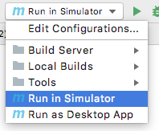
====

Press the green image:images/intellij-run-icon.png[] icon to run the app in the simulator.

See <<first-run-in-simulator>> for the expected result.

[#run-in-netbeans]
[discrete]
=== Running the Project in NetBeans
++++
<env netbeans ></env>
++++

NetBeans supports Maven projects natively.  You can open the project directly in NetBeans using it's `File` > `Open Project...` option.

After the project is open, you can run the app by pressing the green "run" icon (
image:images/netbeans-run-icon.png[]
).

[#run-in-eclipse]
[discrete]
=== Running the Project in Eclipse
++++
<env eclipse></env>
++++

First, we must import the project into Eclipse using _File_ > _Import..._

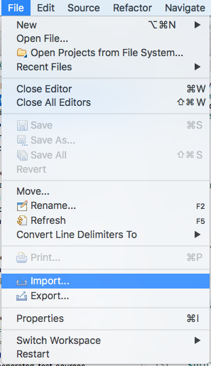

In the _Import_ dialog, select _Maven_ > _Existing Maven Projects_

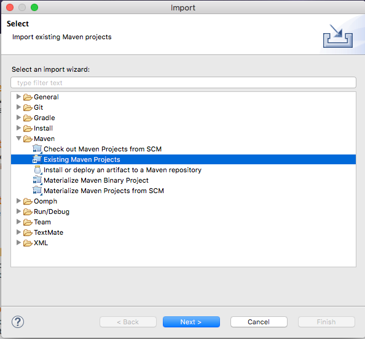

And press _Next_.

In this panel, select (check the boxes beside) all of the projects, and press _Finish_

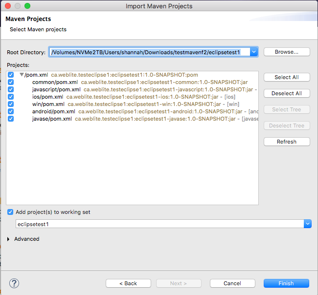

NOTE: This may present a dialog saying that there were errors.  Ignore these for now as it is just a case of Eclipse not understanding the relationships between all the modules yet.

When the project opens, show the Package explorer, and you shoudl see a set of projects like the following:

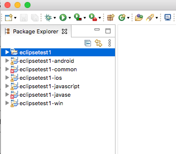

Select the first package in the list (in the screenshot it says "eclipsetest1", but for your project it will be the name that you chose for your project).

Then click the _down_ arrow beside the _Run_ button on the toolbar.  (

)

This should expand to show a menu of all of the build options you have, as shown below:

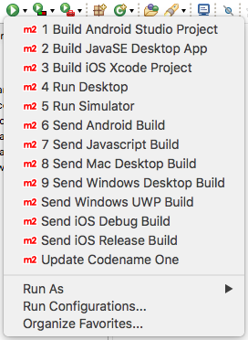

Select the "Run Simulator" option.

[discrete]
[#first-run-in-simulator]
=== The First Run in the Simulator

If you run this project in the Codename One Simulator without making any modifications to the app, it will look something like the following.

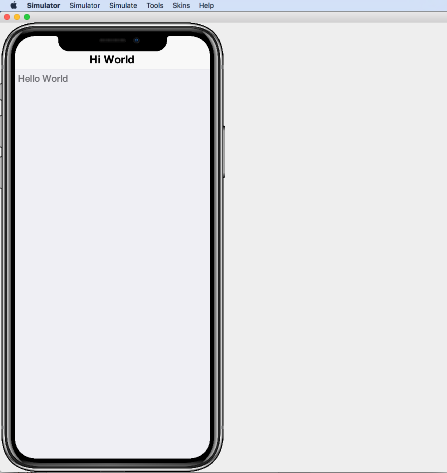

The simulator makes it easy to iteratively develop and debug your app without having to build and deploy to a real device.  It includes a number of useful features aimed at stream-lining the development process.  Generally I will work exclusively in the simulator until I have a near finished product that I want to share with my beta-testers.

For more information about the Codename One simulator, see https://www.codenameone.com/codename-one-simulator.html[this page] in the Codename One website.

== Project Structure

This project is a multi-module Maven project with the following modules:

common::
A Codename One application.  All of your cross-platform application code goes in this module.

android::
Module containing native Android code such as native interface implementations.

ios::
Module containing native iOS code, such as native interface implementations.

javase::
Module containing native JavaSE code, such as native interface implementations.

javascript::
Module containing native javascript code for the Javascript port.

win::
Module containing native Windows UWP code for the UWP windows port.

cn1libs::
Module where legacy cn1libs will be installed the `cn1:install-cn1lib` goal.

=== Project Files

==== A birds-eye View
===== CLI
++++
<env cli></env>
++++

If you list the files in the project directory, you'll see something like:

[source,listing]
----
drwxr-xr-x  26 shannah  staff   832 Feb 24 08:31 .
drwxr-xr-x  58 shannah  staff  1856 Feb 23 08:01 ..
drwxr-xr-x  13 shannah  staff   416 Feb 26 05:45 .git
-rw-r--r--   1 shannah  staff     6 Feb 23 13:02 .gitignore
drwxr-xr-x  10 shannah  staff   320 Feb 25 11:02 .idea
drwxr-xr-x   3 shannah  staff    96 Feb 23 06:35 .mvn
-rw-r--r--   1 shannah  staff  2570 Feb 23 06:35 README.adoc
drwxr-xr-x   4 shannah  staff   128 Feb 23 06:35 android
-rw-r--r--   1 shannah  staff  2975 Feb 23 06:35 build.bat
-rw-r--r--   1 shannah  staff  3311 Feb 23 06:35 build.sh
drwxr-xr-x  10 shannah  staff   320 Feb 25 06:38 common
drwxr-xr-x   9 shannah  staff   288 Feb 26 05:48 docs
-rw-r--r--   1 shannah  staff   106 Feb 23 07:18 generate-app-project.rpf
drwxr-xr-x   5 shannah  staff   160 Feb 25 09:28 ios
drwxr-xr-x   4 shannah  staff   128 Feb 23 06:35 javascript
drwxr-xr-x   6 shannah  staff   192 Feb 23 06:48 javase
-rw-r--r--   1 shannah  staff  6926 Feb 23 06:35 maven.adoc
-rw-r--r--   1 shannah  staff  3621 Feb 23 06:35 nb-configuration.xml
-rw-r--r--   1 shannah  staff   312 Feb 23 06:35 nbactions-Desktop App.xml
-rw-r--r--   1 shannah  staff   312 Feb 23 06:35 nbactions-JavaSE Desktop App.xml
-rw-r--r--   1 shannah  staff   889 Feb 23 06:35 nbactions-Simulator.xml
-rw-r--r--   1 shannah  staff  4683 Feb 23 06:35 nbactions.xml
-rw-r--r--   1 shannah  staff  5054 Feb 23 06:35 pom.xml
-rw-r--r--   1 shannah  staff   502 Feb 23 06:35 run.bat
-rw-r--r--   1 shannah  staff   550 Feb 23 06:35 run.sh
drwxr-xr-x   4 shannah  staff   128 Feb 23 06:35 win
----

===== IntelliJ
++++
<env intellij></env>
++++

When you open the project in IntelliJ IDEA, the project inspector will look like the this.

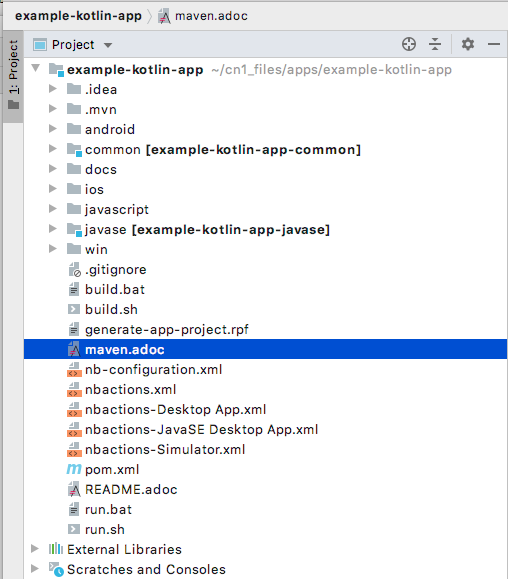

===== NetBeans
++++
<env netbeans></env>
++++

When you open the project in NetBeans, the project inspector will look something like this:

.The project inspector for the root project in NetBeans with the Default profile active.
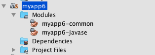

It only lists the "common" and "javase" modules because, with the default configuration, these are the only modules that are "active".  If you click on the configuration menu on the toolbar and select "Android App", as shown below, it will show the "android" module instead of the "javase" module.

.Selecting the "Android" profile from the configuration menu in NetBeans.
image::images/netbeans-select-android-profile.png[]

.Project inspector when the Android profile is selected.  Notice the "android" module is active instead of the "javase" module.
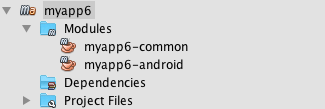

You can see all of the fiiles in the project by changing the view to the "File Inspector" as shown below:

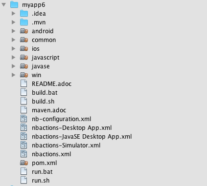

[TIP]
====
You'll almost always be working with the "common" submodule.  This module contains all of your cross-platform Java (and Kotlin) code, your CSS files, your GUI builder files, and your settings.  For this reason, you'll probably want to open this module also, by right-clicking it and selecting "Open Project" (The menu option will say "Open Project of Folder" if you do this from the File Inspector instead of the Project Inspector).:

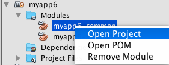

With both the root and the common projects opened, your project inspector will now look something like:

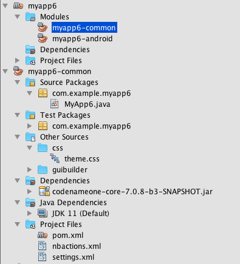
====

IMPORTANT: All of the Codename One build options are defined ONLY on the root module.  If you are editing a file inside the common module, you will need to select the root project in the project inspector to perform a build, or to run the project.  This is an annoyance that we are working on improving with the NetBeans integration.

===== Eclipse
++++
<env eclipse></env>
++++

When you open the project in Eclipse, the package explorer will look something like this:

IMPORTANT: All run and build options should be run with the _root_ project seleted in the package explorer.  If you try to build or run the project with one of the sub-modules (e.g. _xxx-common_, or _xxx-javase_ selected, then the build/run will fail with an error).

==== File Descriptions

Wondering what all of these files are?  Here is a brief overview:

build.bat/build.sh::
A thin CLI wrapper script for building the app for the various build targets from the Command-line.  Use `build.bat` on Windows and `build.sh` on Linux and Ma.

run.bat/run.sh::
A thin CLI wrapper script for running the project inside the Codename one simulator from the command-line.  It can also be used to open the <<settings, Codename One Settings app>>.  Use `run.bat` on Windows or `run.sh` on Linux/Mac.

nbactions.xml, nbactions-*.xml, nb-configuration.xml::
Configuration files for NetBeans that add some convenient menu options for running and building the project.

*.launch::
Configuration files used by Eclipse.

*.adoc::
README files and some documentation to help you get started.

== Editing Java Code

TIP: In this section we jump right into the code without explaining what APIs are available.  See <<api>> for an overview of the supported APIs.

In order to demonstrate how to make this project your own, let's begin by making a button that actually does something.

Open your project's "main" class for editing. Your main class name and path will depend on the values you chose for `mainName` and `packageName` in  the <<generating-new-project, Generating new project step>>.

If you chose "com.example" as your `packageName` and "MyApp" as your `mainName`
then your main class will be located at `common/src/main/java/com/example/MyApp.java`.

The contents of this file will look something like:

[source,java]
----
package com.example;

import static com.codename1.ui.CN.*;
import com.codename1.ui.*;
import com.codename1.ui.layouts.*;
import com.codename1.io.*;
import com.codename1.ui.plaf.*;
import com.codename1.ui.util.Resources;

/**
 * This file was generated by <a href="https://www.codenameone.com/">Codename One</a> for the purpose
 * of building native mobile applications using Java.
 */
public class MyApp {

    // Import statements ...
    public void init(Object context) {
        // init() is called when the app first starts.
    }

    public void start() {
        // start() is called when the app first starts,
        // and when it returns from the background.
    }

    public void stop() {
        // start() is called when the app first starts,
        // and when it returns from the background.
    }

    public void destroy() {
        // destroy() is called when the app exits
    }

}

----

This class is sometimes referred to as the "lifecycle" class because it is called at key points of your app's lifecycle.  Whereas a typical desktop application only inludes a `main()` method, which is executed when the app starts, a mobile app follows a lifecycle pattern more closely resembling that of Applets.

For the purpose of this tutorial, we'll leave the `init()` and `destroy()` methods untouched, and we'll focus on the `start()` and `stop()` methods.

The `start()` method currently looks like:

[source,java]
----
if (current != null) {
    current.show(); <1>
    return;
}

Form hi = new Form("Hi World", com.codename1.ui.layouts.BoxLayout.y()); <2>
hi.add(new Label("Hello World")); <3>
hi.show(); <4>
----
<1> If `current` is not null, that means that the app must be returning from the background and `current` is a reference to the Form that was showing when the app was last stopped.  In this case we'll just show that form again and return.
<2> We create a new `Form`.  The `Form` is the root level UI component.  It is something like the "window" in a desktop GUI framework.
<3> We add a label to the form
<4> We show the form.

=== Adding a Button

Now let's add our button to the form.  Add the following snippet just before the line that says `hi.show()`.

[source,java]
----
Button button = new Button("Click Me");
button.addActionListener (evt -> {
    Dialog.show("Hello", "You clicked me!", "OK", null);
});
hi.add(button);
----

Now run the app in the simulator (as described in <<running>>).  You should see a result like:

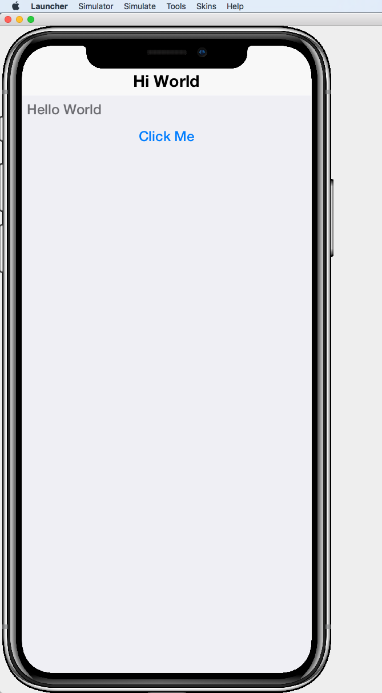

And if you click the "Click Me" button, you should see a dialog appear as shown below:

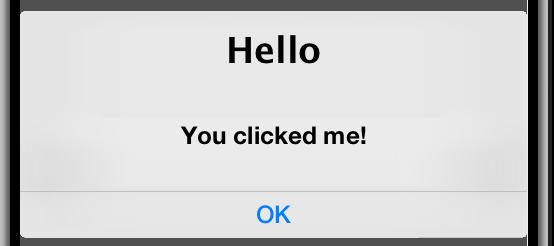

== Editing CSS Stylesheet

The CSS stylesheet for the app allows you to customize many aspects of the look and feel of the app.  By default the app uses a native theme, which means that the UI will look like a Native Android App when running on Android, and it will look like a native iOS app when running on iOS.  You can override the styles in the stylesheet, which is located at:

`common/src/main/css/theme.css`

To demonstrate the use of CSS, let's add a border to all of the buttons in our app.

Open the theme.css file and add the following snippet:

[source,css]
----
Button {
    border: 1px solid gray;
    border-radius: 2mm;
}
----

Now save the CSS file and run the project in the simulator (as described in <<running>>).

When the app is finished loading, you should see a corresponding border around our button as shown below:

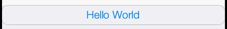

Now let's make a small change to the theme.css file *without closing the simulator* as a way to demonstrate the live-refresh feature of the simulator.

Let's change the border color to blue:

[source,css]
----
Button {
    border: 1px solid blue;
    border-radius: 2mm;
}
----

And save the file.  After a second, or so, you should see this change reflected in the simulator as shown below:

TIP: For a more more information about Codename One's CSS support, and which directives are supported see https://www.codenameone.com/developer-guide.html#_css[the Codename One Developer guide].

== Building the Project

This project includes build goals for a variety of different target platforms.  The following target platforms are supported:

. <<javase, JavaSE Desktop App>>
. <<ios,iOS app>>
. <<android,Android app>>
. Mac Desktop app
. Windows Desktop app
. Windows UWP app
. Javascript app

For most of the build targets you have two choices for how you build your project:

1. *Build Locally*.  You build the project directly on your local machine.  In some cases, this will require you to install additional development tools, and will only work on certain types of environment.  E.g. To build for iOS locally, you must be building the project on a Mac with Xcode installed.
2. *Using the Codename One Build Server*.  Your project is compiled locally to .class files, and then sent to the Codename One build server to generate the native bundles.  This process is seamless, and does not require you to have any special development tools installed on your machine because the build server has all of the toolchains installed.   For more information about Codename One's build server and toolchain see https://www.codenameone.com/build-tools.html[Build Tools].

[#javase]
=== Building JavaSE Desktop App

The "default" build target for this project is as a JavaSE desktop app.  This is basically an executable Jar that can be distributed and run on any computer with a Java Runtime Environment (JavaSE 8 or higher).

NOTE: JavaSE desktop builds are built locally, and do not require any special development tools to be installed, beyond the JDK.

[discrete]
==== CLI
++++
<env cli></env>
++++

Use the "build.sh" (build.bat on Windows) script to build this target from the command line:

[source,bash]
----
./build.sh
----

[TIP]
====
The build.sh script is just a thin wrapper around `mvn`.  You can alternatively build the JavaSE desktop target directly in Maven with:

[source,bash]
----
mvn package -Dcodename1.platform=javase -Pexecutable-jar
----
====

If all goes well, you will find the resulting executable jar in the `javase/target` directory.

[discrete]
==== IntelliJ
++++
<env intellij></env>
++++

Click on the configuration menu and select "Local Builds" > "Cross-platform JavaSE Desktop App" as shown below:

image::images/intellij-javase-desktop-app.png[]

Then press the "run" image:images/intellij-run-icon.png[] button.

If all goes well, you will find the resulting executable jar in the `javase/target` directory.

[discrete]
==== NetBeans
++++
<env netbeans></env>
++++

Click on the "Configuration" Menu on the toolbar, and select "JavaSE App" from the options as shown below:

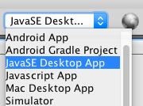

Then press the "build"  button.

If all goes well, you will find the resulting executable jar in the `javase/target` directory.

[discrete]
==== Eclipse
++++
<env eclipse></env>
++++

Click on the  button on the toolbar, and select "Build JavaSE Desktop App" from the options as shown below:

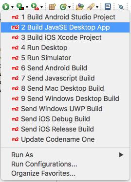

IMPORTANT: Make sure the _root_ module is selected in the package explorer, and not one of the sub-modules, or the build will fail.

If all goes well, you will find the resulting executable jar in the `javase/target` directory.

[#ios]
=== Building for iOS

. <<ios-local-builds, Building Locally>>
. <<ios-server-builds, Using the Codename One Build Server>>

The recommended approach is to use the <<ios-server-builds, build server>> as it doesn't require you to install any special development tools on your computer beyond the standard JDK.

[#ios-local-builds]
==== Building Locally

Building your app for iOS locally involves two steps:

1. <<generate-xcode,Generate an Xcode Project>>
2. Open the generated project in Xcode, and build it.

[#generate-xcode]
===== Generating an Xcode Project

**Prerequisites**

In order to generate an Xcode Project, you must be using a Mac with Xcode installed.  At the time of writing we recommend Xcode 11 or higher.  In addition you will also need to install Cocoapods and xcodeproj.

.Installing Cocoapods and Xcodeproj
[sidebar]
****
To install cocoapods and xcodeproj, run the following command in terminal.

[source,bash]
----
sudo gem install cocoapods
sudo gem install xcodeproj
----

See https://cocoapods.org/[The cocoapods website] for more information about Cocoapods.
****

TIP: If you use one of the <<ios-server-builds, Codename One build server targets>>, you can avoid these requirements (i.e. you won't need a Mac, nor Xtools installed).

[#ios-local-builds-cli]
====== Command-line
++++
<env cli ></env>
++++

Use the `build.sh` or `build.bat` script in the project's root directory as follows:

.Generating Xcode (requires Mac)
[source,bash]
----
./build.sh xcode
----

*Output location:* `ios/target`

If all went well you can proceed to open the Xcode project (the .xcworkspace file) in Xcode, and build the project.

[#ios-local-builds-intellij]
====== IntelliJ IDEA
++++
<env intellij></env>
++++

Click on the "Configuration" menu in the upper right toolbar, and select "Local Builds" > "Xcode iOS Project" as shown below:

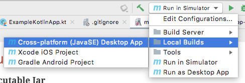

Press the "run" (image:images/intellij-run-icon.png[]) button to build the project.

If all goes well, the project will be found in the `ios/target` directory.

You can proceed to open the Xcode project (the .xcworkspace file) in Xcode, and build the project.

[#ios-local-builds-netbeans]
====== NetBeans
++++
<env netbeans></env>
++++

Press on the configuration menu on the toolbar and select "iOS Xcode Project" as shown below:

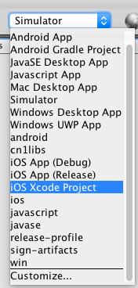

Then press the "run" (image:images/netbeans-run-icon.png[]) button.

If all goes well, the project will be found in the `ios/target` directory.

You can proceed to open the Xcode project (the .xcworkspace file) in Xcode, and build the project.

[#ios-local-builds-eclipse]
====== Eclipse
++++
<env eclipse></env>
++++

Press on the  menu on the toolbar and select "Build iOS Xcode Project" as shown below:

image::images/eclipse-build-ios-xcode-project.png[]

IMPORTANT: Make sure the _root_ module is selected in the package explorer, and not one of the sub-modules, or the build will fail.

If all goes well, the project will be found in the `ios/target` directory.

You can proceed to open the Xcode project (the .xcworkspace file) in Xcode, and build the project.

[#ios-server-builds]
==== Using the Codename One Build Server

There are two build targets for iOS builds that use the build server:

<<ios-debug-build, iOS Debug Build>>::
Use this goal to build an app that you can distribute internally for testing and debugging.

<<ios-release-build,iOS Release Build>>::
Use this goal to build a bundle that you can submit to the iOS App store.

Before you can submit an iOS build to the build server, you need to jump through a few of Apple's hoops.  See <<ios-prerequisites>> for more information about these steps.

[#ios-debug-build]
===== Building iOS Debug Build

====== Command-line
++++
<env cli></env>
++++

Use the `build.sh` or `build.bat` script (depending on whether you're using Windows or Linux/Mac) to submit an iOS debug build to the build server.

.Building iOS debug build on Linux or Mac
[source,bash]
----
./build.sh ios
----

.Building iOS debug build on Windows
[source,bash]
----
build.bat ios
----

[TIP]
====
The build.sh (build.bat) script is just a thin wrapper around the "mvn" command.  You can alternatively run this goal in Maven directly with the command:

[source,bash]
----
mvn package -Dcodename1.platform=ios -Dcodename1.buildTarget=ios-device
----
====

====== IntelliJ IDEA
++++
<env intellij></env>
++++

Click on the configuration menu in the upper right toolbar, and select "Build Server" > "iOS Debug Build" as shown below.

image::images/intellij-build-ios-debug.png[]

Then press the "run" (image:images/intellij-run-icon.png[]) button.

====== NetBeans
++++
<env netbeans></env>
++++

Click on the Configuration menu on the tool bar and select "iOS App (Debug)" as shown below:

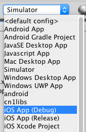

Then press the "Run" image:images/netbeans-run-icon.png[] button.

===== Eclipse
++++
<env eclipse></env>
++++

Click on the  menu on the tool bar and select "Send iOS Debug Build" as shown below:

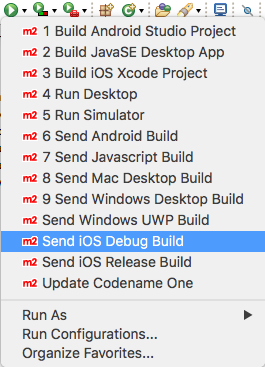

IMPORTANT: Make sure the _root_ module is selected in the package explorer, and not one of the sub-modules, or the build will fail.

===== Downloading Result from the Build Server

After you submit the build, you can follow the progress on the Codename One build server.  See <<build-app>>.

[#ios-release-build]
===== Building iOS Release Build

====== Command-line
++++
<env cli></env>
++++

Use the `build.sh` or `build.bat` script (depending on whether you're using Windows or Linux/Mac) to submit an iOS release build to the build server.

.Building iOS release build on Linux or Mac
[source,bash]
----
./build.sh ios-release
----

.Building iOS release build on Windows
[source,bash]
----
build.bat ios-release
----

[TIP]
====
The build.sh (build.bat) script is just a thin wrapper around the "mvn" command.  You can alternatively run this goal in Maven directly with the command:

[source,bash]
----
mvn package -Dcodename1.platform=ios -Dcodename1.buildTarget=ios-device-release
----
====

====== IntelliJ IDEA
++++
<env intellij></env>
++++

Click on the configuration menu in the upper right toolbar, and select "Build Server" > "iOS Release Build" as shown below.

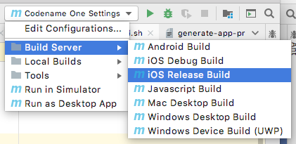

Then press the "run" (image:images/intellij-run-icon.png[]) button.

====== NetBeans
++++
<env netbeans></env>
++++

Click on the Configuration menu on the toolbar and select "iOS App (Release)" as shown below:

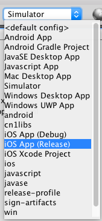

The press the "Run" image:images/netbeans-run-icon.png[] button.

====== Eclipse
++++
<env eclipse></env>
++++

Click on the  menu on the toolbar and select "Send iOS Release Build" as shown below:

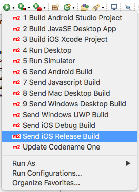

IMPORTANT: Make sure the _root_ module is selected in the package explorer, and not one of the sub-modules, or the build will fail.

===== Downloading Result from the Build Server

After you submit the build, you can follow the progress on the Codename One build server.  See <<build-app>>.

[#android]
=== Building for Android

. <<android-local-builds, Building Locally>>
. <<android-server-builds, Using the Codename One Build Server>>

[#android-local-builds]
==== Building Locally

Building your app for Android locally involves two steps:

1. Generate an Android Studio Project
2. Open the generated project in Android Studio, and build it.

**Prerequisites**

Building an Android app locally requires that you have Android Studio installed.  You can download the latest from https://developer.android.com/studio/#downloads[here].

TIP: If you use the "Android App" build target, which uses the Codename One build server, you don't need to have any special development tools installed because the Android-specific portion of the build is handled on the build server, which has the full toolchain already installed.  See <<android-server-builds>>.

===== Generating an Android Studio Project

[#android-local-builds-cli]
====== Command-line
++++
<env cli ></env>
++++

Use the `build.sh` or `build.bat` script in the project's root directory as follows:

.Generating Android Studio project on Linux or Mac
[source,bash]
----
./build.sh android_source
----

.Generating Xcode project on Windows
[source,bash]
----
build.bat android_source
----

*Output location:* `android/target`

If all went well you can proceed to open the Android Studio project and build the project.

[#android-local-builds-intellij]
====== IntelliJ IDEA
++++
<env intellij></env>
++++

Click on the "Configuration" menu in the upper right toolbar, and select "Local Builds" > "Android Gradle Project" as shown below:

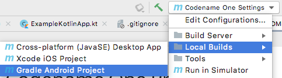

Press the "run" (image:images/intellij-run-icon.png[]) button to build the project.

If all goes well, the project will be found in the `android/target` directory.

You can proceed to open and build the project in Android Studio.

[#android-local-builds-netbeans]
====== NetBeans
++++
<env netbeans></env>
++++

Press on the configuration menu on the toolbar and select "Android Gradle Project" as shown below:

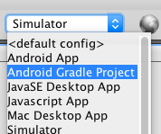

Then press the "run" (image:images/netbeans-run-icon.png[]) button.

If all goes well, the project will be found in the `android/target` directory.

You can proceed to open and build the project in Android Studio.

[#android-local-builds-eclipse]
====== Eclipse
++++
<env eclipse></env>
++++

Press on the  menu on the toolbar and select "Build Android Studio Project" as shown below:

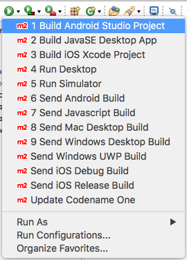

IMPORTANT: Make sure that the _root_ module is selected in the package explorer when you select this option, and not one of the sub-modules, or the build will fail with an error.

If all goes well, the project will be found in the `android/target` directory.

You can proceed to open and build the project in Android Studio.

[#android-server-builds]
==== Using the Codename One Build Server

The Codename One build server will generate an Android app (.apk and .aab) that you can install directly onto your Android device for debugging, or that you can submit to the Google play store.  Unlike the <<android-local-builds, local build option>>, it doesn't require you to install any development tools on your computer beyond the basic JDK install.  Android builds are available with a free Codename One account, which you can create at https://cloud.codenameone.com.

===== Command-line
++++
<env cli></env>
++++

Use the `build.sh` or `build.bat` script (depending on whether you're using Windows or Linux/Mac) to submit an Android build to the build server.

.Building Android app on Linux or Mac
[source,bash]
----
./build.sh android
----

.Building Android app on Windows
[source,bash]
----
build.bat android
----

[TIP]
====
The build.sh (build.bat) script is just a thin wrapper around the "mvn" command.  You can alternatively run this goal in Maven directly with the command:

[source,bash]
----
mvn package -Dcodename1.platform=android -Dcodename1.buildTarget=android-device
----
====

===== IntelliJ IDEA
++++
<env intellij></env>
++++

Click on the configuration menu in the upper right toolbar, and select "Build Server" > "iOS Debug Build" as shown below.

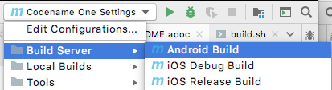

Then press the "run" (image:images/intellij-run-icon.png[]) button.

===== NetBeans
++++
<env netbeans></env>
++++

Click on the configuration menu on the tool bar and select "Android App" as shown below:

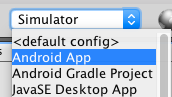

Then press the "run" image:images/netbeans-run-icon.png[] button.

===== Eclipse
++++
<env eclipse></env>
++++

Click on the  button on the toolbar and select "Send Android Build" as shown below:

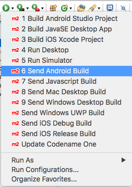

IMPORTANT: Make sure that the _root_ module is selected in the package explorer when you select this option, and not one of the sub-modules, or the build will fail with an error.

===== Downloading Result from the Build Server

After you submit the build, you can follow the progress on the Codename One build server.  See <<build-app>>.

[#mac-desktop]
=== Mac Desktop Builds

NOTE: The Mac Desktop build target uses the Codename One build server, and requires a Codename One Pro-level subscription or higher.  See https://www.codenameone.com/pricing.html[the Codename One website] to sign up for your free 30 day trial.

The Mac Desktop build target will generate a native Mac app bundle (.app).  The output will be either a .dmg file or a .pkg file depending on the settings that you choose inside Codename One Settings.

TIP: This tutorial only shows you how to trigger a Mac desktop build.  More details about Mac desktop builds, including instructions for deploying to the Mac App Store see https://www.codenameone.com/developer-guide.html#_working_with_mac_os_x[Working with Mac OS X] in the Codename One developer guide.

[discrete]
==== CLI
++++
<env cli></env>
++++

Use the `build.sh` (or `build.bat` on Windows) script to initiate a Mac desktop build:

[source,bash]
----
./build.sh mac_desktop
----

[TIP]
====
The build.sh (build.bat) script is just a thin wrapper around the "mvn" command.  You can alternatively run this goal in Maven directly with the command:

[source,bash]
----
mvn package -Dcodename1.platform=javase -Dcodename1.buildTarget=mac-os-x-desktop
----
====

After you submit the build, you can follow the progress on the Codename One build server.  See <<build-app>>.

[discrete]
==== IntelliJ
++++
<env intellij></env>
++++

Click on the "Configuration" menu in the upper right, and select "Build Server" > "Mac Desktop Build" as shown below:

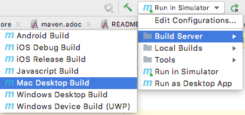

After you submit the build, you can follow the progress on the Codename One build server.  See <<build-app>>.

[discrete]
==== NetBeans
++++
<env netbeans></env>
++++

Click on the configuration menu on the tool bar and select "Mac Desktop App" as shown below:

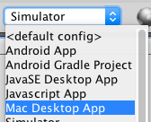

Then press the "run" image:images/netbeans-run-icon.png[] button.

After you submit the build, you can follow the progress on the Codename One build server.  See <<build-app>>.

[discrete]
==== Eclipse
++++
<env eclipse></env>
++++

Click on the  button on the tool bar and select "Send Mac Desktop Build" as shown below:

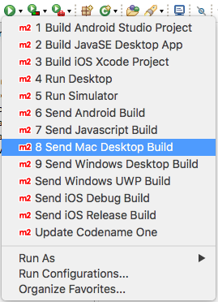

IMPORTANT: All run and build options should be run with the _root_ project seleted in the package explorer.  If you try to build or run the project with one of the sub-modules (e.g. _xxx-common_, or _xxx-javase_ selected, then the build/run will fail with an error).

After you submit the build, you can follow the progress on the Codename One build server.  See <<build-app>>.

[#windows-desktop]
=== Windows Desktop Builds

NOTE: The Windows Desktop build target uses the Codename One build server, and requires a Codename One Pro-level subscription or higher.  See https://www.codenameone.com/pricing.html[the Codename One website] to sign up for your free 30 day trial.

The Windows Desktop build target will generate a native Windows application (.exe).

[discrete]
==== CLI
++++
<env cli></env>
++++

Use the `build.sh` (or `build.bat` on Windows) script in the project directory to initiate a Windows Desktop build as follows:

[source,bash]
----
./build.sh windows_desktop
----

[TIP]
====
The build.sh (build.bat) script is just a thin wrapper around the "mvn" command.  You can alternatively run this goal in Maven directly with the command:

[source,bash]
----
mvn package -Dcodename1.platform=javase -Dcodename1.buildTarget=windows-desktop
----
====

After you submit the build, you can follow the progress on the Codename One build server.  See <<build-app>>.

[discrete]
==== IntelliJ
++++
<env intellij></env>
++++

Click on the "Configuration" menu in the upper right of the toolbar, and select "Build Server" > "Windows Desktop Build" as shown below:

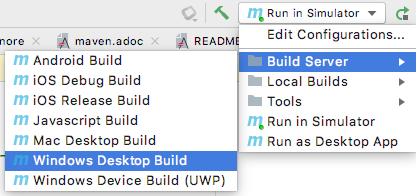

Then press the "run" image:images/intellij-run-icon.png[] button.

After you submit the build, you can follow the progress on the Codename One build server.  See <<build-app>>.

[discrete]
==== NetBeans
++++
<env netbeans></env>
++++

Click on the configuration menu on the tool bar and select "Windows Desktop App" as shown below:

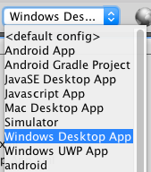

Then press the "run" image:images/netbeans-run-icon.png[] button.

After you submit the build, you can follow the progress on the Codename One build server.  See <<build-app>>.

[discrete]
==== Eclipse
++++
<env eclipse></env>
++++

Click on the  button on the toolbar and select "Send Windows Desktop Build" as shown below:

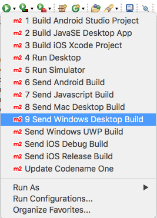

After you submit the build, you can follow the progress on the Codename One build server.  See <<build-app>>.

[#windows-uwp]
=== Windows UWP Builds

NOTE: Windows UWP Builds use the Codename One build server, and are available with a free Codename One account.  You can sign up https://cloud.codenameone.com[here].

The Windows UWP build target will produce an application that can be installed on all windows 10 devices (phones, tablets, laptops, and desktops), and can be distributed via the Windows app store.  Since this build target uses the Codename One build server, it doesn't require any special software to be installed on your build machine beyond the standard JDK.

IMPORTANT: Before you can submit a UWP build you need to create a certificate, and *at least* enter some placeholder information in the "UWP Settings" section of Codename One settings. See https://www.codenameone.com/developer-guide.html#_working_with_uwp[Working with UWP] in the Codename One developer guide.

==== Submitting a UWP Build

===== CLI
++++
<env cli></env>
++++

Use the `build.sh` (`build.bat` on Windows) script in the project's directory to submit a UWP build.

.On Linux/Mac
[source,bash]
----
./build.sh windows_device
----

.On Windows
[source,bat]
----
build.bat windows_device
----

[TIP]
====
The `build.sh`/`build.bat` script is just a thin wrapper around Maven.  You can alternatively submit UWP builds directly using the Maven command:

[source,bash]
----
mvn package -Dcodename1.platform=win -Dcodename1.buildTarget=windows-device
----
====

After you submit the build, you can follow the progress on the Codename One build server.  See <<build-app>>.

===== IntelliJ
++++
<env intellij></env>
++++

Click on the configuration menu in the upper right of the toolbar, and select "Build Server" > "Windows Device Build (UWP)" as shown below.

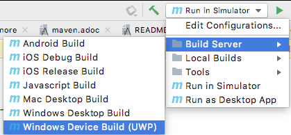

The press the "run" image:images/intellij-run-icon.png[] button.

After you submit the build, you can follow the progress on the Codename One build server.  See <<build-app>>.

===== NetBeans
++++
<env netbeans></env>
++++

Click on the configuration menu on the tool bar and select "Windows UWP App" as shown below:

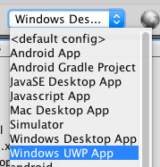

Then press the "run" image:images/netbeans-run-icon.png[] button.

After you submit the build, you can follow the progress on the Codename One build server.  See <<build-app>>.

===== Eclipse
++++
<env eclipse></env>
++++

Click on the  button on the toolbar and select "Send Windows UWP Build" as shown below:

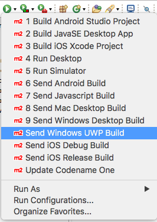

After you submit the build, you can follow the progress on the Codename One build server.  See <<build-app>>.

==== Advanced UWP Options

For more information about UWP builds see https://www.codenameone.com/developer-guide.html#_working_with_uwp[Working with UWP] in the Developer guide.

[#javascript]
=== Javascript Builds

The Javascript build target will generate a pure HTML/Javascript web app that will run in any modern web browser, without requiring any extensions (i.e. Real web app - NOT an applet).  It does this with the help of the fanstatic https://teavm.org[TeaVM] compiler which compiles JVM .class files into highly performant and compact native Javascript.

NOTE: Javascript builds are available to Codename One Enterprise subscribers.  See https://www.codenameone.com/pricing.html[the Codename One website for pricing information].

==== Submitting a Javascript Build

===== CLI
++++
<env cli></env>
++++

Use the `build.sh` (`build.bat` on Windows) script in the project's directory to submit a UWP build.

.On Linux/Mac
[source,bash]
----
./build.sh javascript
----

.On Windows
[source,bat]
----
build.bat javascript
----

[TIP]
====
The `build.sh`/`build.bat` script is just a thin wrapper around Maven.  You can alternatively submit UWP builds directly using the Maven command:

[source,bash]
----
mvn package -Dcodename1.platform=javascript -Dcodename1.buildTarget=javascript
----
====

After you submit the build, you can follow the progress on the Codename One build server.  See <<build-app>>.

===== IntelliJ
++++
<env intellij></env>
++++

Click on the configuration menu in the upper right of the toolbar, and select "Build Server" > "Javascript Build" as shown below.

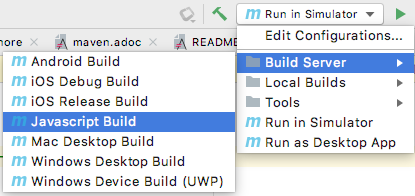

The press the "run" image:images/intellij-run-icon.png[] button.

After you submit the build, you can follow the progress on the Codename One build server.  See <<build-app>>.

===== NetBeans
++++
<env netbeans></env>
++++

Click on the configuration menu on the tool bar and select "Javascript App" as shown below:

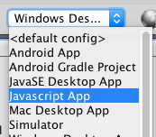

Then press the "run" image:images/netbeans-run-icon.png[] button.

After you submit the build, you can follow the progress on the Codename One build server.  See <<build-app>>.

===== Eclipse
++++
<env eclipse></env>
++++

Click on the  button on the tool bar and select "Send Javascript Build" as shown below:

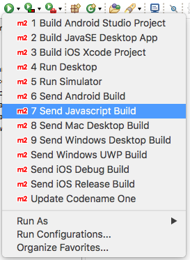

After you submit the build, you can follow the progress on the Codename One build server.  See <<build-app>>.

==== Advanced Javascript Options

For more information about Javascript builds see https://www.codenameone.com/developer-guide.html#_working_with_javascript[Working with Javascript] in the Developer guide.

[appendix]
[#settings]
== Codename One Settings

The Codename One Settings app (aka Codename One Preferences, aka Control Center) allows you to configure many aspects of your application.  This is where you can generate certificates, browse/install add-ons, monitor the status of your cloud builds, configure build hints, and more.

=== Opening Codename One Settings

==== Opening Codename One Settings from Command-line
++++
<env cli ></env>
++++

Use the `run.sh` (or run.bat, if on Windows) to open Codename One settings:

[source,bash]
----
./run.sh settings
----

==== Opening Codename One Settings from IntelliJ
++++
<env intellij ></env>
++++

Click on the "Configuration" menu in the upper right of the toolbar, and select "Tools" > "Codename One Settings" as shown below.

image::images/intellij-open-settings.png[]

==== Opening Codename One Settings from NetBeans
++++
<env netbeans ></env>
++++

Right-click on the project in the project inspector, and select "Maven" > "Open Control Center" as shown below:

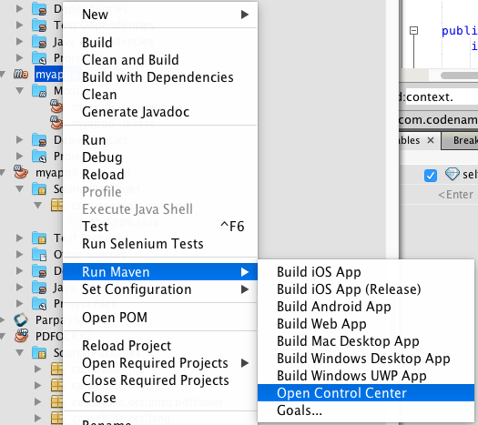

==== Opening Codename One Settings from Eclipse
++++
<env eclipse ></env>
++++

Press the  button and select "Open Codename One Settings" as shown below:

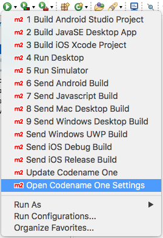

[#dashboard]
=== The Dashboard

Once inside Codename One Settings, you'll see a dashboard like the following:

image::images/control-center-dashboard.png[]

[appendix]
[#ios-prerequisites]
== iOS Prerequisites

Before you can build your app for iOS you need to do a little bit of set-up to satisfy Apple.  This includes activities such as creating an App ID, certificates, and provisioning profiles.  The process can be dull and time-consuming, but luckily Codename One provides a certificate wizard to help you through the process.

IMPORTANT: You must have an Apple Developer account in order to generate certificates and profiles.  You can sign up for an account at https://developer.apple.com/.

=== Generating Certificates

The certificate wizard will allow you to easily generate the certificates and provisioning profiles required to build your app for iOS.  You can access the certificate wizard through Codename One settings.  See <<settings>> for instructions on opening the Codename One Settings console.

==== Using the Certificate Wizard

Starting from the <<dashboard,Codename One Settings dashboard>>.

In the left navigation menu, click on "Device Settings" > "iOS" > "Certificate Wizard".

You should then be prompted to login on a form as shown below:

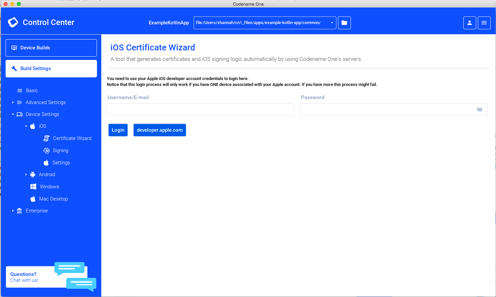

Login using your *Apple Developer* login credentials.

IMPORTANT: You need to log in with your Apple Developer account, and *not* your Codename One account.  This is required by the certificate wizard to be able to generate your provisioning profiles and certificates on your Apple developer account.

NOTE: The login process may take a while.  Be patient.  It is typical for the login to take 30 seconds or more.

Once logged in, you'll be shown a form with all of your existing registered devices.  These are the devices that will be able to install your debug builds.  If you don't see your device listed there yet, click on the "Manage Devices" button and follow the prompts to add your devices to the list.

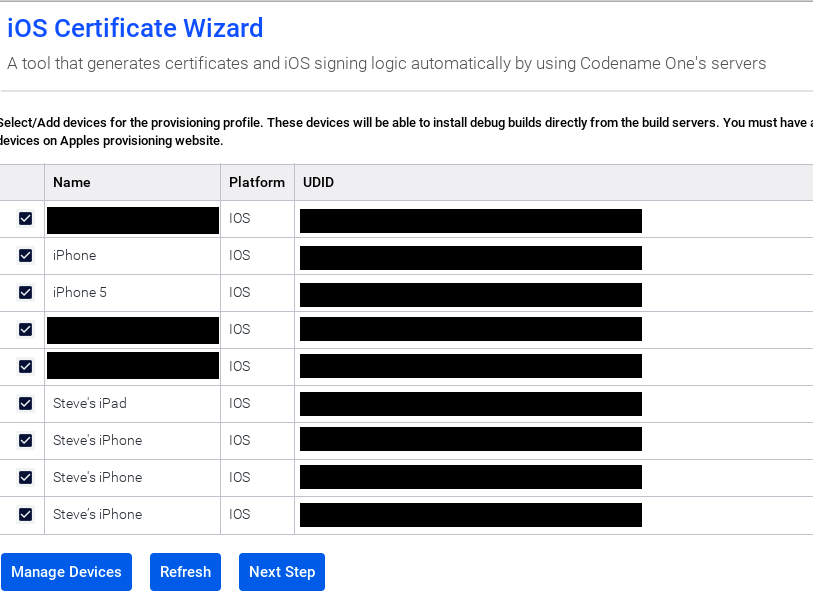

Once you have all of your devices included here, click on the "Next Step" button at the bottom of the form.

The flow of the wizard may vary a little bit depending on the state of your developer account.  E.g. If you already have some certificates listed in Apple, then you will be prompted to rengenerate them:

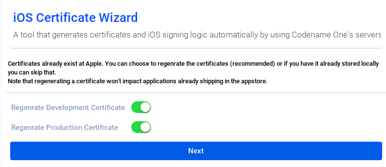

NOTE: Yes, I see the "typo" in the word "Regenrate".  Screenshots are just a pain to *regenrate* after fixing bugs.

If you already have your certificates, and know where they are located, then you don't need to "regenerate" them.  You can unselect these options.  If you aren't sure where they are, or if they are valid anymore, you can just select these boxes and the Certificate wizard will revoke your old certificates and generate new ones for you.

Click "Next" after making your choice.

On the next form you'll be prompted whether to generate Push certificates.  For now, we'll leave this unchecked.  For a birds-eye view of push support, see https://www.codenameone.com/blog/push-cheatsheet.html.

image::images/certificate-wizard-generate-push-certs.png[]

Click "Next"

After a little while (usually about 1 minute), if everything went OK, you should be greated with a "Success" message like the following:

You'll notice that your project now contains a folder (inside the "common" module) named "iosCerts" that includes the following files:

appstore_certificate.p12::
This is the certificate used to sign production iOS builds.  The ones you submit to the app store.

development_certificate.p12::
This is the certificate used to sign development (debug) iOS builds.

development_provisioning_profile.mobileprovision::
This is the provisioning profile used for your development builds.  This includes information such as which development devices you can install your app onto, and what entitlements your app has.  If you change some of the features of your app (e.g. add push support, or add development devices), then you'll need to regenerate the provisioning profile.  Such changes would not require you to regenerate the certificates.

production_provisioning_profile.mobileprovision::
This is the provionsing profile used for your production iOS builds.

[appendix]
[#build-app]
== Using the Codename One Build App

After you submit a build to the Codename One build server, you are asked to follow the build progress at https://cloud.codenameone.com

When you log in, you should see a list of your recent builds as follows:

The length of time required to perform a build will vary depending on the size of the project and the platform target.  Typically Javascript builds complete in under a minute and Android in under two minutes.  iOS builds take the longest because of the extra work involved in compiling a native binary.  Typically iOS builds will take 5 or 6 minutes.

When a build is complete, you'll see a set of links for you to download various aspects of the build.

There are options to email the links to yourself (which you can forward on to your testers), show a QR code (which will allow you to easily install the app on your device), and a direct link to download the app directly.

[appendix]
[#api]
== API

NOTE: This section is not a comprehensive treatment of the Codename One API.  For a more in-depth discussion of Codename One and it's supported APIs, refer to the https://www.codenameone.com/developer-guide.html[Developer Guide].

Codename One apps support a subset of the JavaSE 8 API as well as its own light-weight runtime and UI component library that includes support for everything that would expect in a mobile application platform.

See https://www.codenameone.com/javadoc/[the JavaDocs] for a full list of supported classes, and check out the source in the https://github.com/codenameone/CodenameOne[git repository].

NOTE: The Codename One source is open source.  Released under GPLv2 with Classpath Exception.

Codename One is much more than just an API library.  It provides a full tool-chain and eco-system for developing beautiful, performant native mobile apps with a single codebase in Java and Kotlin.  Please see the https://www.codenameone.com/developer-guide.html#_introduction[introduction in the Developer guide] for a proper overview of Codename One.

=== Limitations

No reflection::
Codename One apps do not support reflection because reflection makes it impossible to keep app-size down.

=== Add-on Libraries

Add-on libraries can be added to your library in the common/pom.xml file, however, if you use APIs that are not supported by Codename One (e.g. which use reflection), then your app will fail to build.

Codename One supports its own library format (cn1lib) which sort of "certifies" that it is compatible with Codename One.  You can browse the growing catalog of available cn1libs inside <<settings,Codename One Settings>>.

For more information about cn1libs, see https://www.codenameone.com/developer-guide.html#_libraries_cn1lib[the cn1libs section] of the developer guide.

